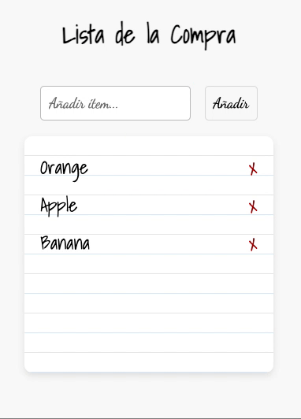

______________________________________________________________
# 🛒 **Aplicación de Lista de la Compra: CRUD con JavaScript**

## **Objetivo**
Esta aplicación permite a los usuarios crear, editar y eliminar productos, facilitando la gestión de una lista de compra básica en CRUD, en JavaScript.

## **Deploy Link**
[Lista de la Compra](https://lluvia-de-bugs.github.io/ex-js-lista-compra/)

### Referencia lista ya estará previamente creada por defecto:

## **Metodologías**
- Agile SCRUM utilizando Trello
- Técnologias utilizadas: HTML5, JavaScript 
- GIT & Git Hub
- MOB Programming
- Mock Api + Postman

## **Arquitectura del proyecto**
shopList/
│
├── index.html                  
│
├── README.md                  
│
├── styles.css                  
│
├── script.js                  
│
├── api/                        
│   └── api.service.js          
│
└── assets/                    

## **Funcionalidades Clave**
- Crear, editar y eliminar productos
- Interfaz responsiva y amigable

## 👁️‍🗨️ Historia de Usuario 1: Ver la lista de ítems

**Como** usuario, **quiero** ver una lista de todos los ítems que he añadido, **para** poder visualizar los artículos pendientes de gestionar.

### 🎯 **Criterios de Aceptación:**

1. La lista debe cargarse automáticamente cuando la aplicación se inicia.
2. Cada ítem debe mostrarse en su propio elemento `<li>`, con un botón de eliminar "x" a la derecha.
3. Si la lista está vacía, no se debe mostrar ningún ítem, pero el contenedor de la lista debe permanecer visible.
4. Los ítems deben aparecer en el orden en el que fueron añadidos.

---

## ➕ Historia de Usuario 2: Añadir un ítem a la lista

**Como** usuario, **quiero** poder añadir un nuevo ítem a la lista, **para** organizar y gestionar los artículos que necesito.

### 🎯 **Criterios de Aceptación:**

1. El usuario debe poder escribir el nombre de un ítem en un campo de entrada y hacer clic en el botón "Añadir" para agregarlo a la lista.
2. El ítem no debe añadirse si el campo de entrada está vacío o si solo contiene espaciones en blanco. En estos casos, se debe mostrar un mensaje de advertencia.
3. Si el ítem ya existe en la lista, debe mostrarse un mensaje (alert o en pantalla) de advertencia indicando que el ítem ya está en la lista. (ej: "manzana" y "Manzana" deben considerarse iguales)
4. El nombre del ítem no debe superar los 25 caracteres. Si se intenta ingresar un ítem más largo, se debe mostrar un mensaje de advertencia.
5. El ítem añadido debe guardarse con la primera letra de cada palabra en mayúscula y el resto en minúsculas (sin importar lo que se ha introducido).
6. Después de agregar el ítem, el campo de entrada debe vaciarse automáticamente.

---

## ❌ Historia de Usuario 3: Eliminar un ítem de la lista

**Como** usuario, **quiero** poder eliminar un ítem de la lista, **para** poder gestionar los artículos que ya no necesito.

### 🎯 **Criterios de Aceptación:**

1. Cada ítem debe tener un botón de eliminar ("x") junto a él.
2. Al hacer clic en el botón "x", el ítem debe eliminarse de la lista.
3. Después de eliminar el ítem, la lista debe actualizarse automáticamente.
4. No se debe pedir confirmación para eliminar el ítem; la eliminación es inmediata.

---

## ✅ Historia de Usuario 4: Marcar un ítem como comprado

**Como** usuario, **quiero** poder marcar un ítem de la lista como "comprado", **para** poder llevar un control visual de los artículos que ya he adquirido.

### 🎯 **Criterios de Aceptación:**

1. Cada ítem debe tener una casilla de verificación (checkbox) al lado que permita marcarlo como "comprado".
2. Al marcar un ítem como comprado, el ítem debe cambiar de estilo visual (por ejemplo, tachado o con un color de fondo distinto).
3. Los ítems comprados deben mantenerse en la lista, pero diferenciados visualmente de los que aún no se han comprado.
4. El usuario debe poder desmarcar el ítem, quitando el estilo de "comprado".

---

## 🌐 Historia de Usuario 5: Sincronizar la lista de ítems con una API (usando IDs)

**Como** usuario, **quiero** que mi lista de la compra se sincronice con una API externa, **para** gestionar los ítems de manera persistente y trabajar con un identificador único (ID) para cada ítem.

### 🎯 **Criterios de Aceptación:**

1. La lista de ítems debe cargarse desde una API de **MockAPI.io** al iniciar la aplicación. Cada ítem tendrá un **ID** único proporcionado por la API.
2. Cuando se añada un nuevo ítem, la aplicación debe hacer una solicitud **POST** a la API y recibir un **ID** generado automáticamente por el servidor.
   - Este **ID** debe guardarse junto con el nombre del ítem en el array de la lista local.
3. Al eliminar un ítem, la aplicación debe enviar una solicitud **DELETE** a la API, usando el **ID** del ítem para identificarlo.
4. Los ítems deben poder marcarse como "comprados" y actualizarse en la API con una solicitud **PUT**, utilizando el **ID** del ítem.
5. Los ítems que se muestran en la lista deben incluir su **ID** oculto en el DOM (aunque no visible al usuario) para poder manejar correctamente las operaciones de actualización y eliminación.
6. Al recargar la página, los ítems deben cargarse de la API, y cada ítem debe aparecer con su nombre y estado de "comprado" o "no comprado".

---

## 📦 **Entregables**

- Repositorio de GitHub con el código del proyecto.
- Página web desplegada en GitHub Pages con la funcionalidad completa.
